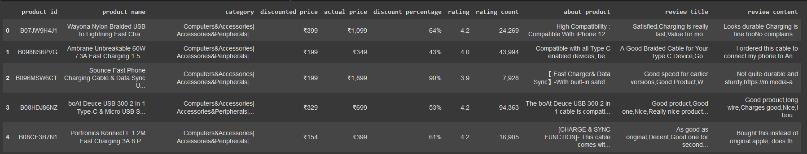

# Laporan Proyek Machine Learning - Thereo Sebastiano Rossi
## Project Overview

Dalam belanja digital, banyaknya pilihan produk membuat pengguna sering kesulitan menemukan produk yang sesuai. Proyek ini mengembangkan sistem rekomendasi berbasis konten yang memanfaatkan data ulasan produk dari Amazon untuk memberikan rekomendasi produk serupa berdasarkan deskripsi produk. Sistem ini menggunakan pendekatan Content-Based Filtering dengan teknik TF-IDF dan Cosine Similarity untuk menilai kesamaan produk berdasarkan atribut dan deskripsi.

Sistem rekomendasi ini penting karena dapat meningkatkan kepuasan pengguna dan membantu mereka membuat keputusan belanja yang lebih cepat dan tepat. Penelitian menunjukkan bahwa rekomendasi yang relevan di platform e-commerce dapat meningkatkan kepuasan pengguna hingga 35% dan mendorong keputusan pembelian

## Business Understanding

Sistem rekomendasi produk berbasis konten ini dikembangkan untuk membantu pengguna menemukan produk yang relevan dengan kebutuhan mereka di tengah banyaknya pilihan di platform e-commerce. Berikut adalah pernyataan masalah dan tujuan proyek ini.

### Problem Statements

1. Bagaimana sistem dapat memberikan rekomendasi produk yang relevan dan sesuai dengan preferensi pengguna?
2. Bagaimana sistem dapat meningkatkan pengalaman pengguna dan membantu mereka dalam membuat keputusan pembelian?

### Goals

1. Membangun model rekomendasi berbasis konten yang mampu menyarankan produk-produk dengan karakteristik serupa berdasarkan deskripsi dan atribut produk.
2. Meningkatkan tingkat relevansi rekomendasi untuk menciptakan pengalaman berbelanja yang lebih personal dan membantu pengguna menemukan produk sesuai preferensi dengan cepat.

### Solution statements
Untuk mencapai tujuan di atas, digunakan pendekatan Content-Based Filtering yang memanfaatkan data ulasan produk:

    - Pendekatan TF-IDF: Untuk mengonversi deskripsi produk menjadi vektor angka, teknik TF-IDF digunakan sehingga model dapat menilai kesamaan antar produk berdasarkan deskripsi teks.
    - Pengukuran Kemiripan dengan Cosine Similarity: Untuk menilai seberapa mirip produk satu dengan yang lain, digunakan Cosine Similarity, yang menghitung kemiripan vektor antar produk untuk menemukan produk dengan atribut yang mirip.

Pendekatan ini diharapkan dapat membantu memenuhi kebutuhan pengguna dalam menemukan produk yang relevan dan meningkatkan pengalaman berbelanja secara keseluruhan.

## Data Understanding
Dataset yang digunakan dalam proyek ini adalah Amazon Sales Dataset, yang berisi data ulasan produk dari Amazon.
    - Dataset ini memiliki total 1465 entri dan 16 kolom.
    - Terdapat 2 missing value pada fitur rating_count sebanyak 2 data
    - Sumber dataset ini berasal dari Kaggle (https://www.kaggle.com/datasets/karkavelrajaj/amazon-sales-dataset).

Dataset ini mencakup berbagai fitur yang relevan untuk membangun sistem rekomendasi produk berbasis konten. Berikut adalah deskripsi masing-masing fitur pada dataset:
 - product_id: ID unik untuk setiap produk.
 - product_name: Nama produk.
 - category: Kategori produk, membantu dalam mengelompokkan produk serupa.
 - discounted_price: Harga produk setelah diskon.
 - actual_price: Harga asli produk sebelum diskon.
 - discount_percentage: Persentase diskon yang diberikan untuk produk.
 - rating: Rating produk, berfungsi sebagai indikator popularitas.
 - rating_count: Jumlah pengguna yang memberikan rating pada produk.
 - about_product: Deskripsi produk yang berisi informasi lengkap mengenai spesifikasi dan fitur.
 - user_id: ID unik untuk setiap pengguna yang memberikan ulasan.
 - user_name: Nama pengguna yang menulis ulasan.
 - review_id: ID ulasan yang ditulis oleh pengguna.
 - review_title: Judul ulasan singkat mengenai produk.
 - review_content: Isi ulasan pengguna yang lebih mendetail.
 - img_link: Tautan gambar produk.
 - product_link: Tautan ke halaman produk resmi di Amazon.

Exploratory Data Analysis (EDA)

Untuk memahami lebih lanjut, dilakukan beberapa teknik analisis eksplorasi, termasuk visualisasi distribusi rating produk, persentase diskon, dan kategori produk yang paling umum.
Insight:

 - Distribusi Rating: Sebagian besar produk memiliki rating yang cukup tinggi, yang menunjukkan bahwa produk di dataset ini umumnya disukai oleh pengguna.
 - Kategori Populer: Beberapa kategori produk muncul lebih sering, yang dapat membantu sistem rekomendasi untuk menyediakan produk alternatif dari kategori populer ini.
 - Analisis Diskon: Produk dengan diskon tinggi memiliki tingkat rating dan ulasan yang lebih bervariasi, yang menunjukkan adanya hubungan antara diskon dan minat pembelian.

EDA ini memberikan pemahaman lebih lanjut mengenai karakteristik data dan membantu dalam menentukan strategi rekomendasi yang lebih akurat.

## Data Preparation
Tahapan Data Preparation dilakukan untuk memastikan bahwa data siap digunakan dalam model rekomendasi produk berbasis konten. Berikut adalah teknik-teknik yang diterapkan beserta penjelasannya:

    1. Handling Duplikasi Data - Langkah pertama adalah menghapus data yang duplikat untuk memastikan bahwa setiap produk atau review unik dan tidak menimbulkan bias.
    2. Handling Missing Values - Pada dataset ini, kami menemukan beberapa nilai yang hilang di fitur tertentu. Baris dengan nilai penting yang hilang akan dihapus, atau diisi jika sesuai.
    3. Feature Selection – Fokus pada pemilihan fitur yang mendukung sistem rekomendasi.
    4. TF-IDF Vectorization - menggunakan TF-IDF Vectorization untuk mengonversi teks pada fitur about_product menjadi fitur numerik. Ini membantu algoritma dalam memahami konten setiap produk secara lebih mendalam untuk proses rekomendasi. 

Tahapan-tahapan ini dilakukan untuk memastikan data siap digunakan dalam model rekomendasi, baik dari segi konsistensi, kebersihan, dan relevansi terhadap produk yang akan direkomendasikan.

## Modeling
Model yang digunakan dalam sistem rekomendasi ini adalah cosine similarity, sebuah metode yang menghitung kesamaan antar item berdasarkan atribut yang diberikan. Dalam konteks proyek ini, atribut yang digunakan adalah about_product, yang memuat informasi rinci tentang produk, seperti deskripsi atau spesifikasi. Model cosine similarity bekerja dengan mengukur sudut antara dua vektor dalam ruang multidimensi, di mana setiap produk direpresentasikan sebagai vektor berdasarkan nilai fitur about_product.

Untuk memproses teks dalam about_product, data terlebih dahulu diubah menjadi representasi vektor menggunakan teknik feature extraction, seperti TF-IDF (Term Frequency-Inverse Document Frequency). Setelah proses ini, model menghitung derajat kesamaan antara produk yang satu dengan yang lainnya. Semakin kecil sudut antar-vektor (mendekati 1 dalam rentang nilai cosine), semakin besar kesamaan antara kedua produk.

Kelebihan Cosine Similarity:

    - Intuitif: Konsep sudut antara dua vektor sangat mudah divisualisasikan dan dipahami secara intuitif. Semakin kecil sudutnya, semakin mirip kedua vektor tersebut.
    - Invariant terhadap panjang vektor: Cosine similarity tidak dipengaruhi oleh panjang vektor, melainkan hanya oleh arahnya. Ini berarti dokumen yang panjang dan pendek dapat dibandingkan secara adil.
    Perhitungan sederhana: Rumus cosine similarity relatif sederhana dan mudah diimplementasikan.

Kekurangan Cosine Similarity:

    - Hanya mengukur kemiripan linear: Cosine similarity hanya efektif dalam mengukur kemiripan antara vektor yang memiliki hubungan linear. Untuk data yang kompleks atau memiliki hubungan non-linear, metrik lain mungkin lebih cocok.
    - Tidak memperhitungkan frekuensi: Cosine similarity tidak memperhitungkan frekuensi kemunculan kata dalam dokumen. Kata yang sangat umum (misalnya, "the", "and") dapat mendominasi perhitungan dan mengurangi akurasi.
    - Sensitif terhadap dimensi: Kinerja cosine similarity dapat terpengaruh oleh jumlah dimensi dalam vektor. Jika dimensi terlalu banyak, perhitungan dapat menjadi kompleks dan memakan waktu.

Top-N Recommendations

Sistem ini memberikan Top-5 Recommendations untuk setiap produk yang dipilih pengguna. Untuk setiap produk yang diinput, model mengembalikan lima produk dengan skor kemiripan tertinggi berdasarkan hasil Cosine Similarity, yang mencakup nama produk, harga diskon, dan rating. Pendekatan ini membantu pengguna menemukan produk serupa yang mungkin relevan atau sesuai dengan preferensi belanja mereka.

    Input:
        Product ID: 'B098NS6PVG'

    Ini adalah produk yang ingin direkomendasikan produk-produk serupa untuknya.

    Output:
        Top-N Recommendations: Tabel yang dihasilkan menampilkan Rank, Product ID, dan About Product dari masing-masing produk rekomendasi. Misalnya, hasilnya mungkin seperti ini:

    

    Pembahasan:
    1. Rekomendasi dihasilkan dengan menggunakan model cosine similarity yang membandingkan atribut about_product dari produk yang dipilih dengan produk lainnya.
    2. Setiap produk dalam daftar rekomendasi memiliki kemiripan konten dengan produk input (product_id = 'B098NS6PVG') dalam hal fitur yang dijelaskan pada atribut about_product.
    3. Semakin tinggi peringkatnya (Rank 1 hingga Rank N), semakin mirip produk tersebut berdasarkan informasi yang terdapat pada about_product.

Hasil tabel ini memberikan pandangan jelas tentang produk-produk yang memiliki deskripsi serupa, sehingga memudahkan pengguna dalam memilih produk alternatif atau pelengkap.

## Evaluation
Sistem rekomendasi ini dievaluasi menggunakan dua metrik utama: Precision@K dan Recall@K. Keduanya digunakan untuk menilai seberapa baik sistem memberikan rekomendasi yang relevan.
Metrik Evaluasi

    Precision@K
    Precision@K mengukur seberapa banyak produk yang direkomendasikan dalam Top-K benar-benar relevan. Rumusnya adalah:
    Precision@K = Produk Relevan dalam Top-KK / K
    Semakin tinggi Precision@K, semakin banyak rekomendasi yang tepat sasaran.

    Recall@K
    Recall@K menghitung berapa banyak produk relevan yang berhasil direkomendasikan dari semua produk relevan yang ada. Rumusnya adalah:
    Recall@K = Produk Relevan dalam Top-KTotal Produk Relevan / Total Produk Relevan
    
    MAP@5 : Mengukur seberapa akurat sistem rekomendasi Anda dalam menempatkan item yang relevan di antara 5 rekomendasi teratas, dirata-ratakan di beberapa kueri atau pengguna.
    Rumusnya adalah:
    AP@K = (1/N) * Σ [Precision(k) * rel(k)]

Hasil Evaluasi

Pada Top-5 Recommendations yang dihasilkan:

    Precision@5 sekitar 0.8 menunjukkan 80% produk dalam Top-5 memang relevan.
    Recall@5 sekitar 0.004, berarti hanya sedikit dari semua produk relevan yang ditemukan oleh sistem.

Model berhasil mengidentifikasi bahwa masalah utama terletak pada cakupan rekomendasi (Recall) yang rendah. Ini menunjukkan bahwa sistem masih banyak melewatkan produk-produk relevan yang seharusnya direkomendasikan. Secara umum, tujuan untuk membangun model rekomendasi yang mampu menyarankan produk-produk dengan karakteristik serupa telah tercapai. Model berhasil mencapai Precision yang tinggi, artinya rekomendasi yang diberikan memang relevan. Namun, tujuan untuk meningkatkan tingkat relevansi secara keseluruhan (Recall) belum sepenuhnya tercapai.

Sesuai dengan solution statement memiliki dampak :
    - Rekomendasi yang lebih relevan: Dengan menggunakan TF-IDF dan cosine similarity, sistem dapat menemukan produk yang memiliki deskripsi yang mirip dengan produk yang sedang dilihat pengguna.
    - Meningkatan efisiensi: Representasi vektor memungkinkan perhitungan kemiripan dilakukan secara cepat dan efisien, bahkan untuk dataset yang besar.
    - Fleksibilitas: Pendekatan ini dapat diterapkan pada berbagai jenis produk, asalkan terdapat deskripsi teks yang cukup.